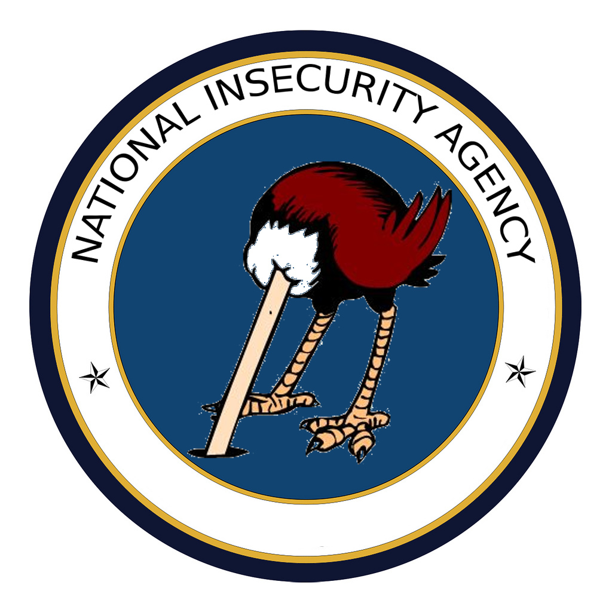

# <p style="text-align:center;">PT Exam @ Unifi</p>


## <p style="text-align:center;">Author</p>
<p style="text-align:center;"><b>Angelo Rosa</b> angelo.rosa@edu.unifi.it</p>
<p style="text-align:center;"><b>Roberto Magrini</b> roberto.magrini@edu.unifi.it</p>

# Summary 

The repo contains all scripts and notes about the PT conducted.

Solved lab: First exam date of the summer session a.k.a `NIA ~ National Insecurity Agency`

##  [Assignment](Assignment%20June%202025.pdf) 
##  [Report Markdown version](report.md)
##  [Report HTML version](report.html)
##  [Report PDF version](report.pdf)
### Resource used for the making the report: https://vulnrepo.com (https://github.com/kac89/vulnrepo)

Repo dump key:

```
4C3t1pE5q;11IW1%o}111j1g5d9i1$|MF16)~gh6L$4373B%F]l4#P@JF~vh&?3#^#1@^FB1{1ebk/3S2,)Z%@7?7hL*M|@?d4*76~212&>M*6Dm3#5%1H~(4_2B32ELO2F4x%%3^@2+@#[1~DqE1K15Fe2@4D6H211?#32$*t}C43L3^/4Fh4oB&6i_^bD8);M:#q2@2*@e3@3bL5yph#cB*25G5`6#Q6#C{1#2/X3DB@()1c37424Hyy$+V#X`
```